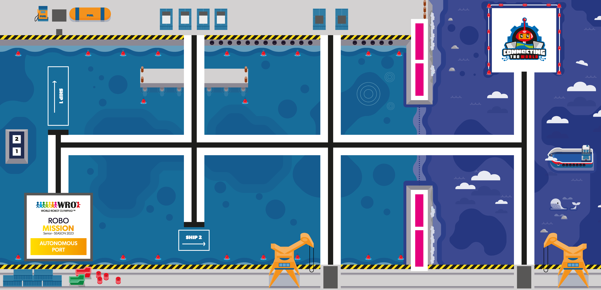

# wro란
[wro](https://www.wrokorea.kr/47)는 로봇이 정해진 트랙을 주행하면서 트랙에 있는 미션을 수행하는 경기 입니다.

[규칙](https://www.wrokorea.kr/32)은 이렇게 있습니다.

이러한 경기장에서 저희는

>* 대형 선박에 연료 공급하기
>* 대형 선박에 컨테이너 싣기
>* 특수 컨테이너 내리기

이러한 미션을 수행을 할것 입니다.

저희는 구간을 두 부분으로 나눠서 진행을 했습니다 1구간은 배를 맵의 오른쪽 끝까지 가지고 가서 미션 대형 선박 연료 공급과 특수 컨테이너 내리기를 2구간은 컨테이너를 가지고와서 대형 선박에 컨테이너를 싣고 골인 지점으로 들어가는 것 입니다.

# 1구간
print

